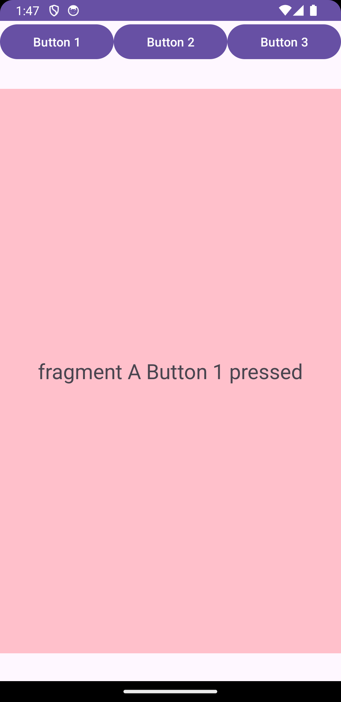
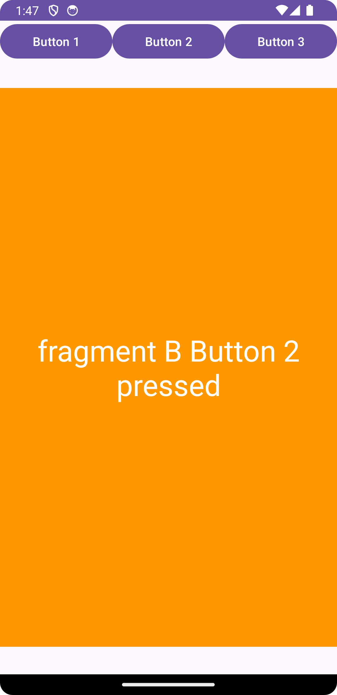
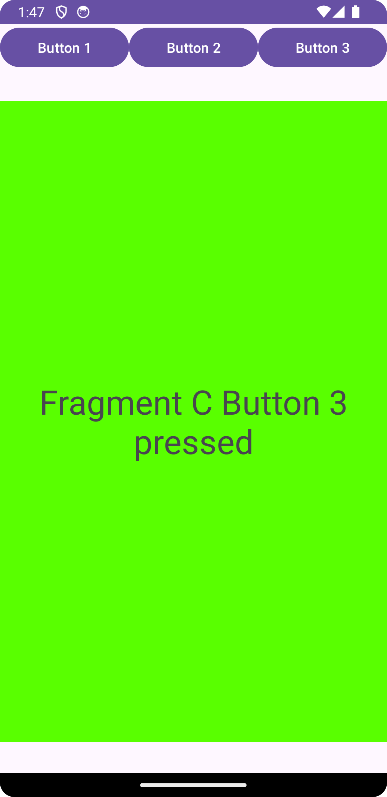

# Fragments Basics Navigation

This project demonstrates fragment-based navigation using buttons.

## Overview

The app consists of three buttons, each associated with a specific fragment. Clicking each button will display a different fragment on the screen.

## Screenshots

- Button 1: 
- Button 2: 
- Button 3: 

## Getting Started

Clone or download the project from this repository.

### Prerequisites

- Android Studio (version XYZ or higher)
- Android SDK
- Git (if cloning the repository)

### Installation

1. Open Android Studio.
2. Choose "Open an existing Android Studio project."
3. Navigate to the project directory and select it.
4. Wait for Gradle sync and project indexing to complete.

## How to Use

1. Launch the application on an emulator or a physical device.
2. Explore the app interface.
3. Click on Button 1 to see Fragment 1, Button 2 for Fragment 2, and Button 3 for Fragment 3.

## Structure

- `MainActivity`: Contains the buttons and handles fragment transactions.
- `Fragment1`: Corresponds to Button 1.
- `Fragment2`: Corresponds to Button 2.
- `Fragment3`: Corresponds to Button 3.

## Resources

- [Android Developer Guide on Fragments](https://developer.android.com/guide/fragments)
- [Android Fragments Tutorial by Vogella](https://www.vogella.com/tutorials/AndroidFragments/article.html)

## License

This project is licensed under the [License Name] - see the [LICENSE.md](LICENSE.md) file for details.
